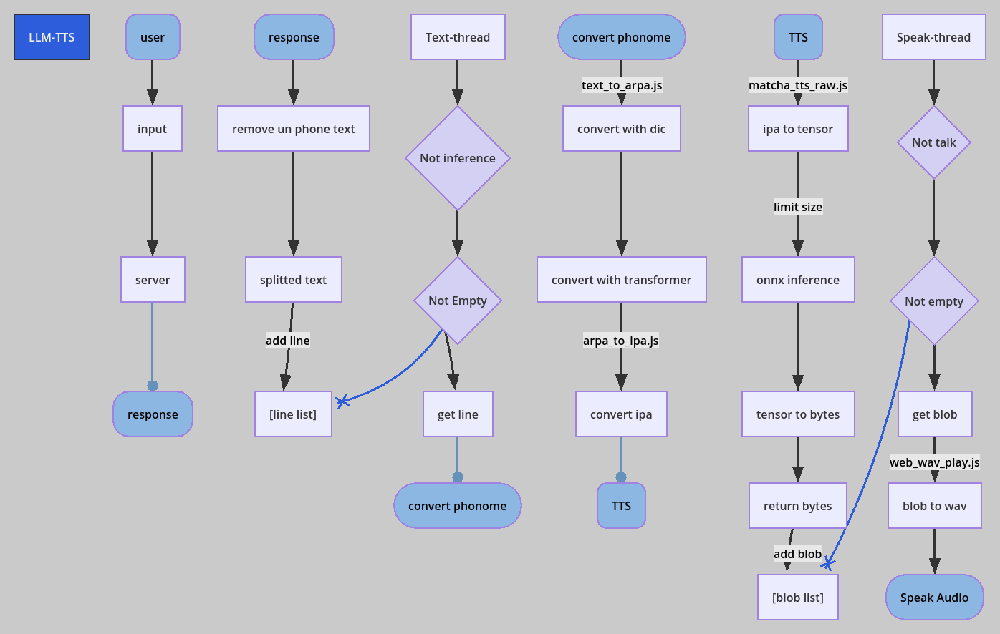

# matcha_tts_onnx js

here is a js-main repo.
v00x-xxxxxxxx are released version and use that.

## HISTORY
### Changed
- support stream.
- remove log and rename js
### v002-20240924 - stream supported version
- speak streamingly
-there are limit max text size,but possible crash on your gpu
### v001-20240921 - first stable varsion
- ** crash if long text send **
- final one speak version
## Probrlems
- sometime crash (maybe audio too big?) - v2 limit size soso fix this problem
- storm of onnx log - transfoerm.js make them,in future there upgrade will fix that
## how this work

### user --> response
just standard gradio app

final return plus ",",because of supporting stream text ignore last line without symbols
```
def generate_text(messages):
    print("generate_text")
    print(messages)
    generated = ""
    for token in client.chat_completion(messages, max_tokens=100,stream=True):
        content = (token.choices[0].delta.content)
        generated += content
        yield generated

    last = generated[-1]
    if last not in [",",".","!","?"]:
        yield generated+"," #no stram version

def call_generate_text(message, history):
    #if len(message) == 0:
    #    messages.append({"role": "system", "content": "you response around 10 words"})
   
    print(message)
    print(history)

    user_message = [{"role":"user","content":message}]
    messages = history + user_message
    try:
        
        assistant_message={"role":"assistant","content":""}
        text_generator = generate_text(messages)

        for text_chunk in text_generator:
            #print(f"chunk={text_chunk}")
            assistant_message["content"] = text_chunk
            updated_history = messages + [assistant_message]
            yield "", updated_history

    except RuntimeError  as e:
        print(f"An unexpected error occurred: {e}")
        yield  "",history
```
### response to store lines
after receive response text ,remove symbols text.

long text need convert time ,split text by ".,!?"

store lines
### Text-Thread --> convert phonome
In this time I choose convert phonome and tts at  once.
so thread need wait onnx-inference.
### convert phonome --> TTTS
convert text to ipa with js.
### TTS store blob
this is the only matcha-tts-onnx part.maybe you can make your tts onnx support version ,editing here.

onnx webgpu seems having max-size I limit text 140 safely,internerly the bytes * 2. 
### Speak-Thread --> Speak Audio
to speak sequencially ,I use thread.

